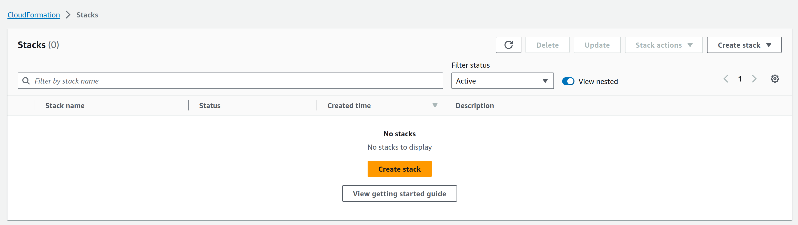
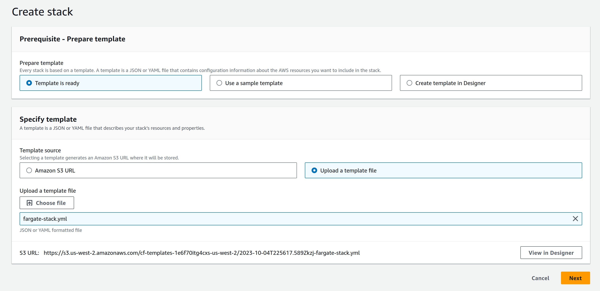
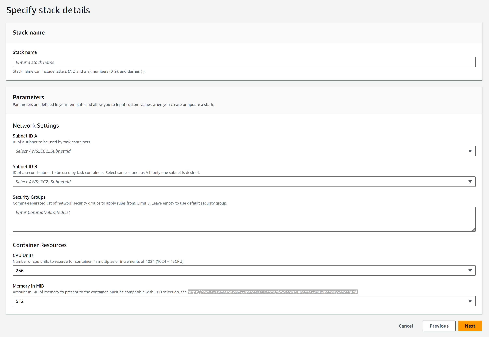
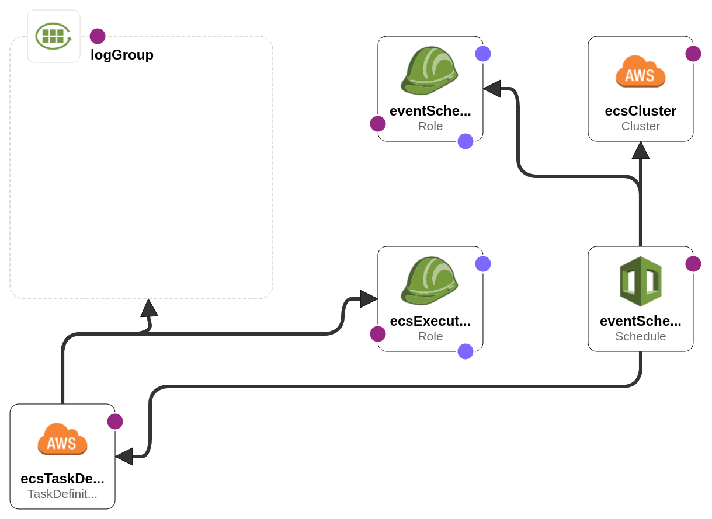

# Fargate scheduled task tech test

For this challenge, we would like you to write a CloudFormation template that meets the following requirements:

* Defines a scheduled Fargate task that runs once per minute. The Fargate task must print a Random Useless Fact obtained from this public API: https://uselessfacts.jsph.pl/api/v2/facts/random to stdout. Only the "text" portion of the API response needs to be printed.
* The Fargate task container must be configured to send stdout to CloudWatch Logs. The reviewer of your submission will check CloudWatch Logs for the expected output.
* The CloudFormation stack should provide the CloudWatch Log Group name associated with the previous item in it's Outputs.
* In this repo you will also find [our CloudFormation style guide](cloudformation-style-guide.md), which goes over the basic CloudFormation guidelines we follow as a company. Please review those and ensure the CloudFormation template(s) you are creating follow the guidelines.
* Be well tested!

In addition to the CloudFormation template, we would also like you to fill in the [Submission Description](#submission-description) section of this README with a brief description of what you're submitting. At a minimum, you should include a description of the architecture and how to deploy it, but feel free to include anything you feel is relevant to the reviewer.

> ❗️ If you're unclear about the requirements or expectations in any way, please reach out and let us know. Being inquisitive and detail-oriented will only make you look better in our eyes, so don't be shy!

## Assumptions

Please assume the following conditions when creating the template:

* The VPC/subnet(s) have already been deployed and their IDs can be provided via parameters
* The provided subnet(s) already have access to the internet via a NAT Gateway
* The template **should not** assume the existence of a default VPC.

## Submission Instructions

Please create a zip file containing the CloudFormation template and any other required files and send it to Cloud303.

Please note that the reviewer will attempt to deploy your template, so please ensure that your code is portable across AWS accounts and regions. 

---

## Submission Description

### Deployment

#### Via AWS Console
1. From the desired region, navigate to CloudFormation -> Stacks. Click Create Stack.



2. Under "Specify template", check the radio button for "Upload a template file". Click "Choose
file", and select `fargate-stack.yml` from the project directory. Click Next.



3. Fill in the desired values for the stack parameters. Required parameters are Stack name, Subnet
ID A, and Subnet ID B. If you wish to use only one subnet, simply specify the same subnet ID for
both A and B. Security Groups and Container Resources are optional, defaults are as shown for the
Container Resources, and if the Security Groups input is left blank, the default security group
will be used. Take care if choosing values other than the defaults for Container Resources, there
are only specific combinations of CPU Units and Memory allowed for Fargate, see
[this chart](https://docs.aws.amazon.com/AmazonECS/latest/developerguide/task-cpu-memory-error.html)
(also linked in the parameter description).



4. Click Next. Change any defaults as desired on the following page, or leave as is and click Next
again. Scroll to the bottom of the review page and click the acknowledgement that the stack is
creating IAM resources. Finally, click Submit, and wait for your stack to be created. Once the
stack creation is finished, you can view the stack outputs (the CloudWatch log group name) from the
"Outputs" tab of this same page.

#### Via AWS CLI
1. If not done already, install the CLI following the appropriate instructions for your operating
system [here](https://aws.amazon.com/cli/), and configure credentials for the account you wish to
deploy to using your preferred method from
[here](https://docs.aws.amazon.com/cli/latest/userguide/cli-chap-configure.html).
2. Invoke the
[cloudformation create-stack](https://docs.aws.amazon.com/cli/latest/reference/cloudformation/create-stack.html)
command, with appropriate arguments for the template location and stack parameters, e.g.
```
$ aws cloudformation create-stack \
    --region us-west-2 \
    --stack-name cloud303RandomFactsFetcher \
    --template-body file://fargate-stack.yml \
    --parameters pSubnetA=subnet-02147756062f94fb1,pSubnetB=subnet-54378361flk
```
3. If successful, the call to `create-stack` will return a StackId in the response that is the ARN
of the stack. The
[`describe-stacks`](https://docs.aws.amazon.com/cli/latest/reference/cloudformation/describe-stacks.html)
command can be used with the stack name you passed to monitor the creation of the stack, and to
retrieve the stack outputs (in this case, the CloudWatch log group) once it is finished creating.

### Architecture



For our architecture, we have an ECS cluster using capacity provided by Fargate. Tasks are
scheduled on this cluster by an EventBridge Scheduler Schedule resource, with a Schedule Expression
set to a rate of once per minute. The Schedule schedules tasks using an ECS Task Definition, which
is defined to create a container from a publicly available DockerHub container image. The container
is configured to run `curl` against our Random Facts API, and parse out the text of the response
with `jq`. It is further configured to log all stdout to a defined CloudWatch Log Group, in the
general case this stdout will consist simply of the text from the Random Facts API response. The
container exits immediately after running the startup command, and the task is stopped, ending
compute resource utilization until the next scheduled task invocation. IAM Roles are defined and
attached to both the Schedule and the Task Definition, these use AWS Managed Policies to grant
common permissions to these resources, such as logging to CloudWatch and placing tasks in the ECS
cluster queue.

#### Alternative Architectures Considered

* AWS Lambda + EventBridge schedule rule: This is conceptually very similar to our chosen
architecture, but would offer some advantages in terms of complexity and integration. There
would be no need to maintain an ECS cluster or utilize Fargate, and the task logic could be readily
defined in a Lambda definition without the need to create our own container image or find a
suitable public image. CloudWatch metrics exist by default for failing Lambda invocations, so it
would be trivial to configure alerting based on task failures, without the need to create custom
metrics or event rules. This architecture was not chosen for the simple fact that it does not meet
the criteria of the assignment, because it does not utilize Fargate.
* EKS on Fargate: Kubernetes is a very powerful container orchestration system, offering many
advantages for complex service applications. Given the simplicity of the assigned task, ECS was
deemed to be a better fit for its relatively lower complexity.

### Limitations

* Less than perfect minute intervals: As you view the log streams created by each task invocation
in the CloudWatch log group, you may notice that they are not perfectly spaced in one minute
intervals, although they do average out to one invocation per minute. This is because while the
EventBridge schedule schedules a task every minute, there is some variance in the time ECS takes to
provision the container for the task, leading to deviations in the range of 1-5 seconds from the
once-per-minute schedule in the actual task invocation times. If needed, one possible remediation
would be to replace the scheduled tasks with an ECS service that keeps one container active at all
times, and to configure this container to stay up and make repeated calls to the API on a one
minute schedule. However, from a conceptual standpoint, this would seem to violate the intent of
the exercise, in that less benefit would be seen from using an on-demand, pay for the compute
minutes you use service such as Fargate, in that we would be using the same fixed compute resources
at all times, with no downtime between invocations where we weren't being charged for those
resources. In practice, this may not actually translate to a lower cost, given that the period
between scheduled tasks is so short.
* No health checks: Because the containers for our task are very short lived, running a single
simple command and immediately exiting, it was found that no valid health check configuration
existed that could execute and return results before the container exited. For longer running
tasks, or for any persistent task such as described in the alternate setup in the above bullet,
we would want to strongly consider configuring health checks for our task containers. For a
possible way of monitoring overall task success within our current setup, see the Possible
Extensions section below.

### Testing

[`cfn-lint`](https://github.com/aws-cloudformation/cfn-lint) was used throughout development for
template validation. Functional testing was performed against my personal AWS account, with a
variety of combinations of subnets, security groups, and container resource values. Given that this
project as implemented uses only AWS provided resources and a public DockerHub container image, no
unit tests were deemed valuable. For a note on possible integration test strategies, see the 
Possible Extensions section below.

### Assumptions made

In addition to the assumptions listed in the project spec, this project additionally assumes that
for the subnet IDs provided, the subnets will *not* be configured to automatically assign IP
addresses. The one relevant line of code for this assumption is called out via a comment, with
instructions for the necessary code change if subnets are passed that are configured to
automatically assign IPs.

### Possible Extensions

#### Custom CloudWatch Event Rule

ECS does not currently expose any metrics for ECS container exit codes. There is a feature request
on [their roadmap](https://github.com/aws/containers-roadmap/issues/559#event-2769369153) to do so.
In the meantime, a custom CloudWatch Event rule could be defined that would track non-zero
container exit codes, and could be given triggers to e.g. an SNS topic or a Lambda function, either
of which could be used to drive alerting on failures of our scheduled task. Such a rule might look
like the following, with the targets defined elsewhere in the template, or passed in via ARN as
parameters:

```
taskErrorsEventRule:
    Type: AWS::Events::Rule
    Properties:
      Description: Rule that will trigger on ECS tasks exiting with non-zero exit codes.
      EventPattern: |
        {
          "source": [ "aws.ecs" ],
          "detail-type": [ "ECS Task State Change" ],
          "detail": {
            "lastStatus": [ "STOPPED" ]
          },
          "containers": {
            "exitCode": [
              {
                "anything-but": 0
              }
            ]
          }
        }
      Targets:
        - errorEventTargetA
        - errorEventTargetB
```
For the scope of this project, it was decided that the complexity of a valid EventBridge target
definition is high enough that attempting to model the range of possible target types via
parameters would overly complicate the template input model, so this feature has been omitted.

#### Test Automation

A more mature implementation of this project might include automated linting, using either the
`cfn-lint` CLI tool that was used informally during development of this project, or the
[Validate Template](https://docs.aws.amazon.com/AWSCloudFormation/latest/APIReference/API_ValidateTemplate.html)
API exposed by AWS. A useful extension would be to automate one of these linting methods with a git
hook, to ensure that linting succeeds before pull requests can be made against the code repository.

Integration testing could be approached at a minimal level with the
[Create Change Set](https://docs.aws.amazon.com/AWSCloudFormation/latest/APIReference/API_CreateChangeSet.html)
API, for example by running the change set against a stack that doesn't exist (to obtain a complete
list of stack resources), and then comparing that set against a baseline. More advanced integration
testing could utilize a staging environment to create a stack from the template, and then use the
AWS CLI or SDKs to describe the stack, comparing it against and expected baseline.

### Notes on style

In addition to following the provided CloudFormation style guide, a pair of stylistic choices were
made in the construction of the CloudFormation template for this project. 

The first is that wherever possible, names were not provided for the various AWS resources defined, 
instead allowing CloudFormation to auto-generate unique names for the resources. In my experience,
the tradeoff of having resources that can be more easily updated without replacement (name changes
typically require replacement) and having guaranteed uniqueness for resource names is worth the
pain of having less aesthetically pleasing names for individual stack resources, but I want to 
recognize that this is a stylistic choice that may vary between organizations and customers.

The second is that no tags were created on any resources. Again, in my experience, tags can be a
very useful tool, but the approach to tagging is extremely variable between organizations and
customers, and so the safest default is to not define any to begin with, and add them to the
template later as the organization or customer tagging strategies dictate.

### Support

Please feel free to direct any inquiries or support questions related to this document directly to
the developer, at cmccoypdx@gmail.com.
